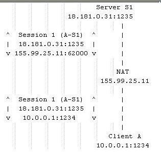
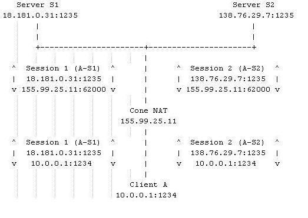
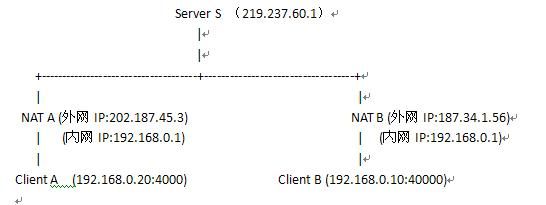

# 一、P2P实现的原理
## 1.1 基本概念
首先先介绍一些基本概念
### NAT(Network Address Translators)，网络地址转换
网络地址转换是在IP地址日益缺乏的情况下产生的，它的主要目的就是为了能够地址重用。NAT从历史发展上分为两大类:
1. 基本的NAT(Network Address)
2. NAPT(Network Address/Port Translator)
#### 基本的NAT(Network Address)
最先提出的是基本的NAT(peakflys注：刚开始其实只是路由器上的一个功能模块)， 它的产生基于如下事实：**一个私有网络（域）中的节点中只有很少的节点需要与外网连接（这是在上世纪90年代中期提出的）。那么这个子网中其实只有少数的节点需要全球唯一的IP地址，其他的节点的IP地址应该是可以重用的。因此，基本的NAT实现的功能很简单，在子网内使用一个保留的IP子网段，这些IP对外是不可见的。子网内只有少数一些IP地址可以对应到真正全球唯一的IP地址。 如果这些节点需要访问外部网络，那么基本NAT就负责将这个节点的子网内IP转化为一个全球唯一的IP然后发送出去。(基本的NAT会改变IP包中的原IP地址，但是不会改变IP包中的端口)** ，他又可以分为如下两种类型：

- 静态NAT
	它将内部私网地址与合法公网地址进行一对一的转换，且每个内部地址的转换都是确定的；
- 动态NAT
	它也是将内部私网地址与合法公网地址进行一对一的转换， 但是它的合法公网是从合法公网地址池中动态选择一个未使用的地址来对内部私有地址进行转换；

### NAPT(Network Address/Port Translator)
NAPT不但会改变经过这个NAT设备的IP数据报的IP地址，还会改变IP数据报的TCP/UDP端口。基本NAT的设备可能我们见的不多（基本已经淘汰了），NAPT才是我们真正需要关注的。它也是一种动态转换，而且多个内部地址被转换成同一个合法公网地址，使用不同的端口号来区分不同的主机，不同的进程；

如上图所示：有一个私有网络10.*.*.*，Client A是其中的一台计算机，这个网络的网关（一个NAT设备）的外网IP是155.99.25.11(应该还有一个内网的IP地址，比如10.0.0.10)。如果Client A中的某个进程（这个进程创建了一个UDP Socket,这个Socket绑定1234端口）想访问外网主机18.181.0.31的1235端口，那么当数据包通过NAT时会发生什么事情呢？
1. 首先
	NAT会改变这个数据包的原IP地址，改为155.99.25.11。
2. 然后
	NAT会为这个传输创建一个Session,（Session是一个抽象的概念，如果是TCP，也许Session是由一个SYN包开始，以一个FIN包结束。而UDP呢，以这个IP的这个端口的第一个UDP开始，结束呢，呵呵，也许是几分钟，也许是几小时，这要看具体的实现了）并且给这个Session分配一个端口，比如62000，然后改变这个数据包的源端口为62000。所以本来是**（10.0.0.1:1234->18.181.0.31:1235）的数据包到了互联网上变为了:（155.99.25.11:62000->18.181.0.31:1235）**
3. 最后
	一旦NAT创建了一个Session后，NAT会记住62000端口对应的是10.0.0.1的1234端口，以后从18.181.0.31发送到62000端口的数据会被NAT自动的转发到10.0.0.1上。（注意：这里是说18.181.0.31发送到62000端口的数据会被转发，其他的IP发送到这个端口的数据将被NAT抛弃）这样Client A就与Server S1建立以了一个连接。
## 1.2 NAT类型
上面的是一些基础知识，下面的才是关键的部分了，看看下面的情况：

接上面的例子，如果Client A的原来那个Socket(绑定了1234端口的那个UDP Socket)又接着向另外一个Server S2发送了一个UDP包，那么这个UDP包在通过NAT时会怎么样呢？这时可能会有两种情况发生:
1. 一种是NAT再次创建一个Session，并且再次为这个Session分配一个端口号（比如：62001）。
2. 一种是NAT再次创建一个Session，但是不会新分配一个端口号，而是用原来分配的端口号62000。 
前一种NAT叫做Symmetric NAT(对称型NAT)，后一种叫做Cone NAT(圆锥型NAT)。如果你的NAT刚好是第一种，那么很可能会有很多P2P软件失灵。（可庆幸的是，现在绝大多数的NAT属于后者，即Cone NAT）

---
PS:**Cone NAT具体又分为3种：**
1. 全圆锥( Full Cone) : 
	NAT把所有来自相同内部IP地址和端口的请求映射到相同的外部IP地址和端口。任何一个外部主机均可通过该映射发送IP包到该内部主机。
2. 限制性圆锥(Restricted Cone) : 
	NAT把所有来自相同内部IP地址和端口的请求映射到相同的外部IP地址和端口。但是,只有当内部主机先给IP地址为X的外部主机发送IP包,该外部主机才能向该内部主机发送IP包。
3. 端口限制性圆锥( Port Restricted Cone) :
	端口限制性圆锥与限制性圆锥类似,只是多了端口号的限制,即只有内部主机先向IP地址为X,端口号为P的外部主机发送1个IP包,该外部主机才能够把源端口号为P的IP包发送给该内部主机。

---
> 好了，我们看到，通过NAT,子网内的计算机向外连结是很容易的（NAT相当于透明的，子网内的和外网的计算机不用知道NAT的情况）。但是如果外部的计算机想访问子网内的计算机就比较困难了（而这正是P2P所需要的）。

那么我们如果想从外部发送一个数据报给内网的计算机有什么办法呢？
首先，我们必须在内网的NAT上打上一个“洞”（也就是前面我们说的在NAT上建立一个Session），这个洞不能由外部来打，只能由内网内的主机来打。而且这个洞是有方向的，比如从内部某台主机（比如：192.168.0.10）向外部的某个IP(比如：219.237.60.1)发送一个UDP包，那么就在这个内网的NAT设备上打了一个方向为219.237.60.1的“洞”，（这就是称为UDP Hole Punching的技术）以后219.237.60.1就可以通过这个洞与内网的192.168.0.10联系了。（但是其他的IP不能利用这个洞）。

# 二、P2P的常用实现
## 2.1 普通的直连式P2P实现
通过上面的理论，实现两个内网的主机通讯就差最后一步了：那就是鸡生蛋还是蛋生鸡的问题了，两边都无法主动发出连接请求，谁也不知道谁的公网地址，那我们如何来打这个洞呢？
我们需要一个中间人来联系这两个内网主机。现在我们来看看一个P2P软件的流程，以下图为例：

- 首先
	Client A登录服务器，NAT A为这次的Session分配了一个端口60000，那么Server S收到的Client A的地址是202.187.45.3:60000，这就是Client A的外网地址了。
- 同样
	Client B登录Server S，NAT B给此次Session分配的端口是40000，那么Server S收到的B的地址是187.34.1.56:40000。
- 此时
	Client A与Client B都可以与Server S通信了。如果Client A此时想直接发送信息给Client B，那么他可以从Server S那儿获得B的公网地址187.34.1.56:40000，是不是Client A向这个地址发送信息Client B就能收到了呢？ 答案是不行，因为如果这样发送信息，NAT B会将这个信息丢弃（因为这样的信息是不请自来的，为了安全，大多数NAT都会执行丢弃动作）。
- 现在
	我们需要的是在NAT B上打一个方向为202.187.45.3（即Client A的外网地址）的洞，那么Client A发送187.34.1.56:40000的信息,Client B就能收到了。这个打洞命令由谁来发呢？自然是Server S。
- 总结
	如果Client A想向Client B发送信息，那么Client A发送命令给Server S，请求Server S命令Client B向Client A方向打洞。然后Client A就可以通过Client B的外网地址与Client B通信了。
	

